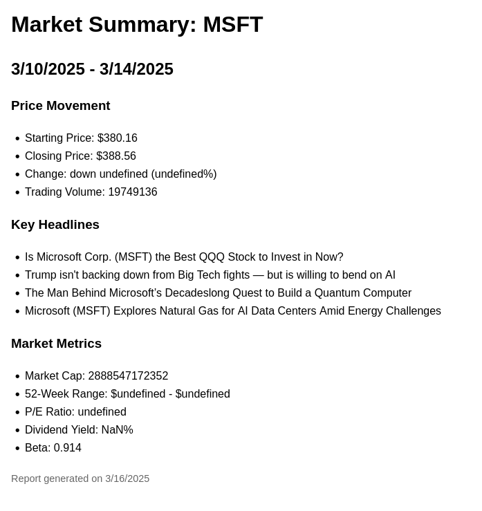

# AI Finance Monitor - Apify Actor

## Overview
The AI Finance Monitor is an Apify Actor designed to generate market reports based on user queries. By inputting a search query such as "How is Microsoft doing this week?", the actor fetches relevant financial data, analyzes it, and produces a structured market summary.

## Features
- **Market Summary**: Provides a high-level overview of stock performance.
- **Price Movement**: Includes starting and closing prices, percentage changes, and trading volume.
- **Key Headlines**: Fetches and summarizes the latest news related to the searched company.
- **Market Metrics**: Reports important financial metrics like market capitalization, P/E ratio, and beta.
- **Automated Report Generation**: Outputs a structured summary in a user-friendly format.

## Input
The actor takes a single search query as input:
```json
{
    "OPENAI_API_KEY": "", //optional
    "researchRequest": "How is microsoft doing this week?"
}
```

## Output
### Be sure to check the "Storage > Key-value store output tab for the HTML/MD report files.
The actor produces two outputs:
- JSON data output of the raw data
- HTML human-readable report 

## Html Output


## JSON Output
The output is a JSON object containing:
```json
{
		"results": {
			"price": {
				"regularMarketPrice": 388.56,
				"previousClose": 378.77,
				"dayLow": 379.51,
				"dayHigh": 389.79,
				"open": 379.92,
				"volume": 19749136,
				"marketCap": 2888547172352,
				"trailingPE": 31.34,
				"forwardPE": 25.99,
				"dividendRate": 3.32,
				"dividendYield": 0.0085,
				"exDividendDate": "2025-05-15",
				"fiftyTwoWeekLow": 376.91,
				"fiftyTwoWeekHigh": 468.35
			},
			"summaryDetail": {
				"shortName": "Microsoft Corporation",
				"longName": "Microsoft Corporation",
				"currency": "USD",
				"beta": 0.914
			}
		},
		"chart": {
			"meta": {
				"currency": "USD",
				"symbol": "MSFT",
				"exchangeName": "NMS",
				"fullExchangeName": "NasdaqGS",
				"instrumentType": "EQUITY",
				"firstTradeDate": "1986-03-13T14:30:00.000Z",
				"regularMarketTime": "2025-03-14T20:00:01.000Z",
				"hasPrePostMarketData": true
			},
			"quotes": [
				{
					"date": "2025-03-10T13:30:00.000Z",
					"high": 386.39,
					"low": 377.22,
					"open": 385.84,
					"close": 380.16,
					"volume": 32840100
				},
				{
					"date": "2025-03-11T13:30:00.000Z",
					"high": 386,
					"low": 376.91,
					"open": 379,
					"close": 380.45,
					"volume": 30380200
				},
				{
					"date": "2025-03-12T13:30:00.000Z",
					"high": 385.22,
					"low": 378.95,
					"open": 382.95,
					"close": 383.27,
					"volume": 24253600
				},
				{
					"date": "2025-03-13T13:30:00.000Z",
					"high": 385.32,
					"low": 377.45,
					"open": 383.16,
					"close": 378.77,
					"volume": 20473000
				},
				{
					"date": "2025-03-14T13:30:00.000Z",
					"high": 390.23,
					"low": 379.51,
					"open": 379.78,
					"close": 388.56,
					"volume": 19929300
				}
			],
			"events": {
				"dividends": [
					{
						"date": 1684108800,
						"amount": 3.32
					}
				]
			},
			"priceHint": 2
		},
		"news": [
			{
				"uuid": "a779f012-c27d-35ae-a9e9-29dd5c5ee6b4",
				"title": "Is Microsoft Corp. (MSFT) the Best QQQ Stock to Invest in Now?",
				"publisher": "Insider Monkey",
				"link": "https://finance.yahoo.com/news/microsoft-corp-msft-best-qqq-025150139.html",
				"providerPublishTime": "2025-03-16T02:51:50.000Z",
				"type": "STORY",
				"thumbnail": {
					"resolutions": [
						{
							"url": "https://s.yimg.com/uu/api/res/1.2/FPV7LMJx9t7xViBmxMrZWw--~B/aD04MTY7dz0xNDU2O2FwcGlkPXl0YWNoeW9u/https://media.zenfs.com/en/insidermonkey.com/ae3cb2a93ad8e5ddf6f94148e71f74b9",
							"width": 1456,
							"height": 816,
							"tag": "original"
						},
						{
							"url": "https://s.yimg.com/uu/api/res/1.2/snE9DwM_Mhbq41k5r0NVHA--~B/Zmk9ZmlsbDtoPTE0MDtweW9mZj0wO3c9MTQwO2FwcGlkPXl0YWNoeW9u/https://media.zenfs.com/en/insidermonkey.com/ae3cb2a93ad8e5ddf6f94148e71f74b9",
							"width": 140,
							"height": 140,
							"tag": "140x140"
						}
					]
				}
			}
		]
}
```

## Usage
1. Deploy the actor on Apify.
2. Provide a search query as input.
3. The actor retrieves, processes, and returns a structured market summary.

## Limitations
- Some financial data may be unavailable or labeled as "undefined" if not accessible at runtime.
- News headlines are fetched from external sources and may vary in availability.

## Future Enhancements
- Improve data accuracy by integrating with multiple financial APIs.
- Support for historical comparisons and trend analysis.
- Extend coverage to cryptocurrencies and commodities.

## License
This project is licensed under the MIT License.

